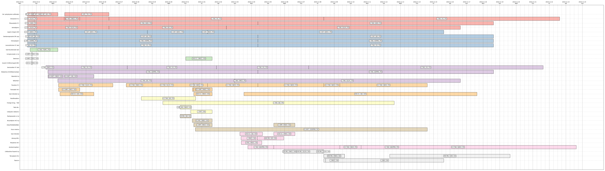
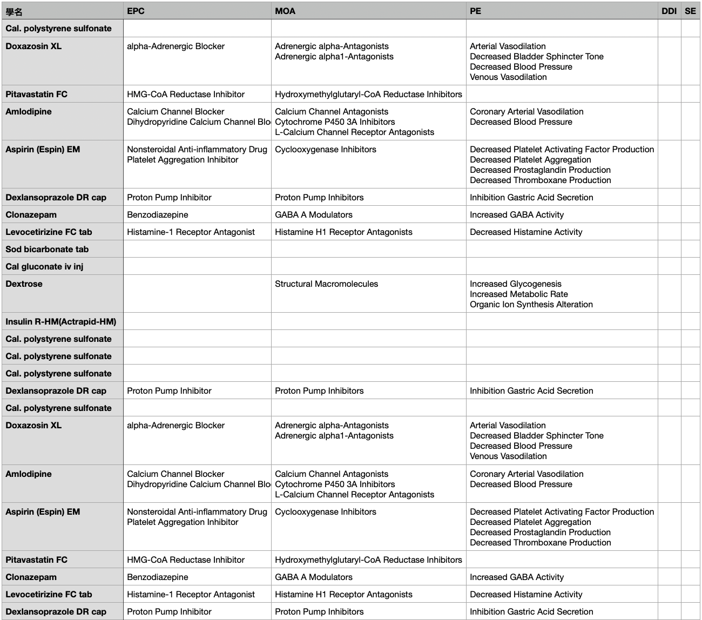

# Rx2Gantt



Rx2Gantt is a Python-based project designed to streamline the process of extracting, processing, and visualizing medication-related data from PDF files. It processes medical prescription records from Taipei Veterans General Hospital to generate structured summaries and visual Gantt charts for clear, timeline-based insights into medication usage.

## Features

- **PDF Data Extraction**: Extracts prescription details from PDF files.
- **Data Cleaning and Processing**: Cleans and preprocesses extracted data, including handling dates, merging rows, and standardizing drug names.
- **Drug Classification**: Enriches the data with drug classifications such as MOA (Mechanism of Action), EPC (Established Pharmacologic Class), and PE (Physiologic Effect) via the RxNav API.
- **Gantt Chart Visualization**: Creates a detailed Gantt chart showing medication timelines, dosages, and frequencies.

---

## Installation

1. Clone the repository:
   ```bash
   git clone https://github.com/jimchen1551/Rx2Gantt.git
   cd Rx2Gantt
   ```

2. Install the required dependencies:
   ```bash
   pip install -r requirements.txt
   ```

3. Update the configuration:
   - Open `config.py` and update the `INPUT_FOLDER` variable to point to the directory containing your PDF files.

---

## Usage

1. Place your PDF files in the folder specified in the `INPUT_FOLDER` variable.

2. Run the project:
   ```bash
   python main.py
   ```

3. Outputs:
   - **CSV File**: A summary CSV file for each PDF, saved in the `summary` folder within the same directory as the input PDF.
   - **Gantt Chart**: A visual representation of the medication timeline, saved as a PNG file in the `gantt` folder.

---

## File Structure

```
Rx2Gantt/
├── examples              # Examples for ouput files
├── config.py             # Configuration settings
├── main.py               # Main entry point for the program
├── pdf_processor.py      # PDF extraction logic
├── data_cleaner.py       # Data cleaning and preprocessing logic
├── drug_classifier.py    # Drug classification using RxNav API
├── gantt_visualizer.py   # Gantt chart visualization logic
├── requirements.txt      # Python dependencies
└── README.md             # Project documentation
```

---

## Configuration

The `config.py` file contains customizable settings, including:
- **Input Folder**: The directory containing PDF files to process.
- **Column Boundaries**: x-coordinate boundaries for column detection in PDFs.
- **RxNav API URL**: Base URL for drug classification.
- **Logging Level**: Adjust logging verbosity (default: `INFO`).
- **Chart Color Scheme**: Matplotlib color scheme for the Gantt chart.

---

## Dependencies

- Python 3.8 or higher
- `fitz` (PyMuPDF) for PDF processing
- `pandas` for data handling
- `matplotlib` for Gantt chart visualization
- `requests` for RxNav API calls

Install dependencies with:
```bash
pip install -r requirements.txt
```

---

## Example Output

### CSV Summary



A sample CSV output includes enriched data with classifications:
```
Drug name, EPC, MOA, PE, DDI, SE
Aspirin, Cyclooxygenase Inhibitor, Platelet Aggregation Inhibition, Analgesic Effect, , 
```

### Gantt Chart


The Gantt chart visually displays medication timelines, highlighting:
- **Start and stop dates** of each medication
- **Dosage** and **frequency** annotations

---

## Contributing

We welcome contributions! To contribute:
1. Fork the repository.
2. Create a feature branch: `git checkout -b feature-name`.
3. Commit your changes: `git commit -m "Add new feature"`.
4. Push to the branch: `git push origin feature-name`.
5. Open a pull request.

---

## License

This project is licensed under the MIT License. See the [LICENSE](LICENSE) file for details.

---

## Acknowledgments

- RxNav API: [https://rxnav.nlm.nih.gov](https://rxnav.nlm.nih.gov)
- Matplotlib for charting

---

## Contact

For questions or feedback, please open an issue on the repository or contact the project maintainer.
